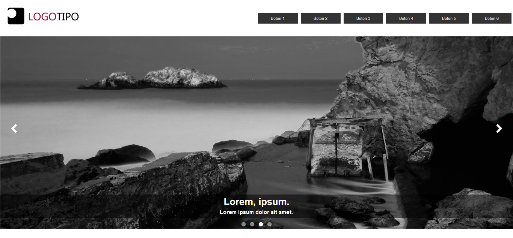

Slideshow - JS 🚀
===========
📋 Slideshow realizado con Vanilla JS
   Tiene la opción de avanzar, retroceder, paginación y automatización por tiempo.

## Realizado con 🛠️
* HTML
* CSS
* JS

## Autores ✒️
* **Michel Hdez** - (https://github.com/MichelHdez)
